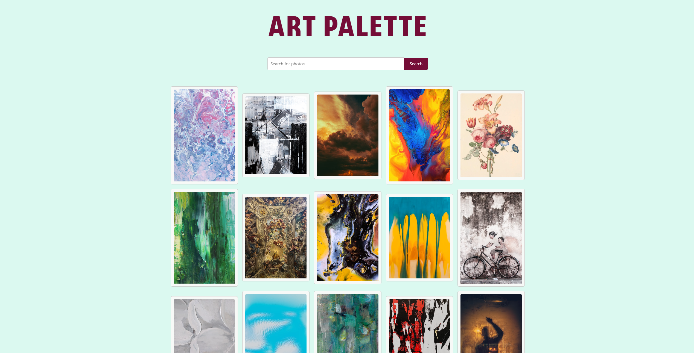
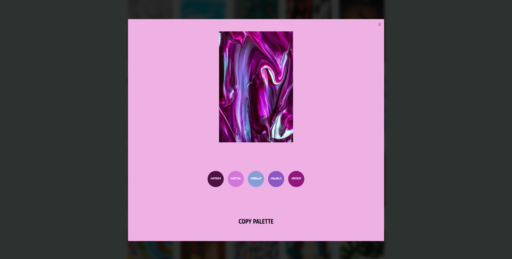

# Art-Palette

Art-Palette is a React application that utilizes the Unsplash API to generate a grid of random images. When an image is selected, a modal window pops up using React Modal to display the image. The application also extracts the colour palette from the selected image using the ColorThief library and displays it in the modal. This allows users to find inspiration from new images and discover colour palettes that match their inspiration. The modal's background colour is the colour opposite to the main palette colour on the colour wheel. Users can click on each colour to copy it to their clipboard.

## Screenshots

Here are a few screenshots of the project:

### Landing page:


### Modal once an image is selected:


## Prerequisites

To run this application, you will need the following:

- Node.js (version 12 or above)
- Unsplash API access key

## Getting Started

To get started with the application, follow these steps:

1. Clone the repository:

   ```shell
   git clone https://github.com/your-username/Art-Palette.git
   ```

2. Navigate to the project directory:

   ```shell
   cd Art-Palette
   ```

3. Install the dependencies:

   ```shell
   npm install
   ```

4. Replace the Access_Key in the following line of App.js with your Unsplash API access key:

   ```javascript
   const clientID = "Access_Key";
   ```

5. Start the application:

   ```shell
   npm start
   ```

6. Open your browser and visit http://localhost:3000 to see the application in action.

## Usage

* The application will initially load and display a grid of 30 random images fetched from the Unsplash API.
* Clicking on an image will open a modal window displaying the full-size image along with its colour palette extracted using ColorThief.
* To close the modal, click the "X" button or anywhere outside the modal.

## Customisation

You can customize the application according to your needs by modifying the code. Here are a few possibilities:

* Adjust the number of images fetched by changing the `count` variable in `App.js`.
* Modify the orientation of the fetched images by changing the `orientation` variable in `App.js`.

## Acknowlegements
This application was developed using React, React Modal, ColorThief, and the Unsplash API.
